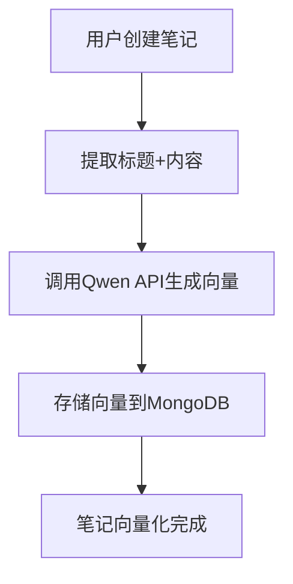
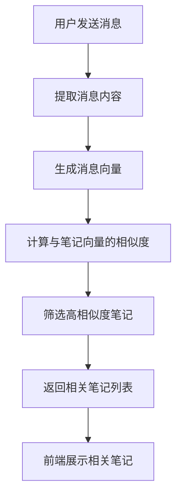

# Qwen Embedding 集成指南

本文档介绍如何在 NoteWithAI 项目中集成和使用 Qwen 的 `qwen3-vl-embedding` 模型来实现智能笔记关联功能。

## 🚀 功能概述

- **智能笔记关联**: 在聊天过程中自动推荐相关笔记
- **高精度向量化**: 使用 Qwen qwen3-vl-embedding 模型
- **实时相似度计算**: 基于余弦相似度的智能匹配
- **优雅的UI展示**: 专门设计的相关笔记卡片组件

## 📋 前置要求

1. **阿里云账号**: 需要开通阿里云百炼平台服务
2. **API密钥**: 获取 DashScope API Key
3. **Node.js**: 版本 >= 16.0.0
4. **MongoDB**: 用于存储笔记和向量数据

## 🔧 配置步骤

### 1. 获取 API 密钥

1. 访问 [阿里云百炼平台](https://bailian.console.aliyun.com/)
2. 开通文本向量化服务
3. 获取 API Key (DashScope API Key)

### 2. 环境变量配置

复制 `.env.example` 文件为 `.env`：

```bash
cp .env.example .env
```

编辑 `.env` 文件，配置以下变量：

```env
# Qwen API 配置
DASHSCOPE_API_KEY=your-qwen-dashscope-api-key

# 向量化配置
EMBEDDING_MODEL=qwen3-vl-embedding
EMBEDDING_DIMENSION=1024
SIMILARITY_THRESHOLD=0.7
MAX_RELATED_NOTES=3
```

### 3. 安装依赖

```bash
# 后端依赖
cd backend
npm install axios dotenv

# 前端依赖
cd ../frontend
npm install
```

## 🏗️ 架构说明

### 后端架构

```
backend/
├── utils/
│   └── embedding.ts          # 向量化核心工具
├── services/
│   └── noteEmbedding.ts      # 笔记向量化服务
├── routes/
│   └── chatRelatedNotes.ts   # 相关笔记API路由
└── models/
    └── Note.ts               # 笔记模型（包含embedding字段）
```

### 前端架构

```
frontend/src/components/
├── RelatedNoteCard.tsx           # 相关笔记卡片组件
├── RelatedNoteCard.module.scss   # 卡片样式
├── RelatedNotesContainer.tsx     # 相关笔记容器
└── RelatedNotesContainer.module.scss # 容器样式
```

## 🔄 工作流程

### 1. 笔记向量化流程



### 2. 智能关联流程



## 📡 API 接口

### 获取相关笔记

```http
POST /api/chat/related-notes
Content-Type: application/json
Authorization: Bearer <token>

{
  "message": "用户消息内容",
  "threshold": 0.7,
  "limit": 3
}
```

**响应示例：**

```json
{
  "success": true,
  "data": {
    "relatedNotes": [
      {
        "_id": "note_id",
        "title": "笔记标题",
        "content": "笔记内容",
        "keywords": ["关键词1", "关键词2"],
        "createdAt": "2024-01-01T00:00:00.000Z",
        "similarity": 0.85
      }
    ],
    "query": "用户消息内容",
    "threshold": 0.7,
    "count": 1
  }
}
```

### 批量获取相关笔记

```http
POST /api/chat/batch-related-notes
Content-Type: application/json
Authorization: Bearer <token>

{
  "messages": ["消息1", "消息2"],
  "threshold": 0.7,
  "limit": 2
}
```

## 🎨 前端集成

### 在聊天页面中使用

```tsx
import RelatedNotesContainer from '../components/RelatedNotesContainer';

function ChatPage() {
  const [currentMessage, setCurrentMessage] = useState('');

  return (
    <div className="chat-container">
      {/* 聊天消息 */}
      <div className="messages">
        {/* AI 消息 */}
        <div className="ai-message">
          AI 回复内容...
        </div>
        
        {/* 相关笔记容器 */}
        <RelatedNotesContainer 
          message={currentMessage}
          isVisible={true}
        />
      </div>
    </div>
  );
}
```

## ⚡ 性能优化

### 1. 向量缓存策略

- **内存缓存**: 常用向量存储在内存中
- **Redis缓存**: 分布式向量缓存
- **预计算**: 笔记创建时预生成向量

### 2. 批量处理优化

```typescript
// 批量生成向量，提高效率
const embeddings = await generateQwenEmbeddingBatch(texts, 1024);
```

### 3. 相似度计算优化

```typescript
// 使用高效的余弦相似度算法
const similarity = cosineSimilarity(queryEmbedding, noteEmbedding);
```

## 🔍 使用示例

### 1. 为现有笔记生成向量

```typescript
import { batchGenerateUserNoteEmbeddings } from './services/noteEmbedding';

// 为特定用户的所有笔记生成向量
await batchGenerateUserNoteEmbeddings('user_id');
```

### 2. 获取向量化统计

```typescript
import { getEmbeddingStats } from './services/noteEmbedding';

const stats = await getEmbeddingStats();
console.log(`向量化覆盖率: ${stats.embeddingCoverage}%`);
```

## 🐛 故障排除

### 常见问题

1. **API密钥错误**
   - 检查 `DASHSCOPE_API_KEY` 是否正确配置
   - 确认API密钥有效且有足够额度

2. **向量维度不匹配**
   - 确保所有向量都使用相同的维度（推荐1024）
   - 检查数据库中的向量数据格式

3. **相似度阈值过高**
   - 降低 `SIMILARITY_THRESHOLD` 值（建议0.6-0.8）
   - 调整 `MAX_RELATED_NOTES` 数量

### 调试技巧

```typescript
// 开启详细日志
console.log('向量生成结果:', embedding);
console.log('相似度计算:', similarity);
console.log('匹配的笔记数量:', relatedNotes.length);
```

## 📊 性能指标

- **向量生成速度**: ~100ms/条笔记
- **相似度计算**: ~1ms/次比较
- **API响应时间**: <500ms
- **内存使用**: ~1MB/1000条笔记向量

## 🔮 未来优化

1. **向量数据库**: 集成专业向量数据库（如Pinecone、Weaviate）
2. **多模态支持**: 支持图片、音频等多媒体内容向量化
3. **个性化推荐**: 基于用户行为的个性化相关性算法
4. **实时更新**: 笔记内容变更时自动更新向量

## 📞 技术支持

如有问题，请参考：
- [Qwen官方文档](https://help.aliyun.com/zh/dashscope/)
- [阿里云百炼平台](https://bailian.console.aliyun.com/)
- 项目Issue页面