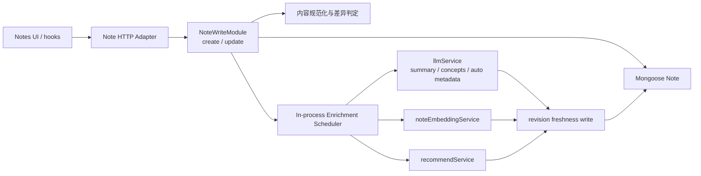

# Note 架构收敛 Phase 1：写入生命周期与工程验证基线

日期：2026-08-18

状态：已确认范围，待 Terra 实施

实施模型：GPT Terra

验收模型：提出本 Spec 的原审查 Session

## 1. 决策摘要

本阶段只处理两类已经产生现实成本的问题：

1. 建立可以一条命令运行、会正常退出的测试与类型检查基线。
2. 深化现有 Note 写入模块，使一次用户写入由后端统一负责内容规范化、乐观并发、派生数据失效和 AI 富化调度；前端不再串联 embedding、摘要和相关推荐请求。

同时只收敛 Note 领域的 HTTP 契约和 Note 路径中的 LLM 调用缝隙。以下事项明确不在本阶段实施：Chat session 重构、全站 DTO 迁移、微服务、消息队列、通用 repository、事件总线、通用工作流引擎、推荐模块拆分。

目标不是增加抽象层，而是把已经散落在多个调用者中的同一组业务规则收回一个有深度的模块。现有模块化单体和 MongoDB/Mongoose 方案继续保留。

## 2. 再评估：必要性、收益与成本

| 候选项 | 现实问题 | 收益 | 成本/风险 | 本阶段决定 |
|---|---|---:|---:|---|
| 统一验证入口、修复测试不退出 | 根目录、前后端缺少一致的 `test`/`typecheck`/`verify` 入口；后端测试完成断言后仍可能被模块级定时器保持运行 | 高：降低 Terra 实施和后续验收的不确定性，让架构改造有可重复证据 | 低：脚本和生命周期修复；主要风险是暴露既有失败 | 必须做，且先做 |
| Note 写入生命周期收敛 | 创建通常触发 4 次请求，正文编辑通常触发 3 次请求；前后端同时安排 embedding，摘要阈值和推荐刷新散落 | 很高：减少重复调用和竞态，统一内容语义、失效规则和错误模型 | 中高：涉及 schema、服务、路由适配和前端 hooks；需保护现有脏改动 | 必须做，是本阶段主体 |
| 全站 HTTP Contract 迁移 | 前端存在双响应形状解析，类型从后端手工复制 | 中高：长期可减少漂移 | 高：会同时波及 Auth、Chat、Profile、Recommend 等已在改动的区域 | 只规范 Note 契约；全站迁移延期 |
| Chat session 状态收敛 | 状态分布在服务端、React state 和 localStorage | 中：可改善恢复和一致性 | 高：Chat 最近已有大范围改动，回归面大，且当前功能可用 | 延期，单独立项 |
| LLM seam 清理 | Note 路径直接实例化 DeepSeek client；存在废弃空 embedding 导出和失真的 README | 中：降低 provider 绕过和误用概率 | 低，但全量 provider 重构会扩大范围 | 只清理 Note 路径和明显陈旧项 |
| 拆分 `recommendService` | 文件较深但其复杂度主要来自一个完整推荐流程 | 低或负：拆分会分散同一算法知识 | 高：接口增加、局部性下降 | 不做，继续作为 deep module |
| Repository Interface | 当前只有 Mongoose 一个生产实现 | 低：没有第二适配器需求 | 中：会产生透传式假抽象 | 不做 |
| Durable queue / worker | 当前富化是 best-effort，进程退出可能丢任务 | 中：提高交付保证 | 很高：新增基础设施、部署和运维语义 | 不做；用状态与维护入口显式承认限制 |
| 微服务拆分 | 当前是单体部署且边界尚在收敛 | 负：会把本地调用变成分布式协作 | 很高 | 不做 |

判断标准：本阶段的改动必须至少消除一种已经存在的重复知识、竞态、不可验证状态或大体积传输；不能仅以“更现代”或“以后可能需要”为理由。

## 3. 当前证据与问题定义

以下是实施前必须保留为对照的事实：

- `frontend/src/app/notes/hooks/useCreateNote.ts` 在创建成功后主动调用 embedding、自动摘要 PATCH 和相关推荐刷新；后端 `backend/services/noteService.ts` 的创建路径本身也会安排 embedding。
- `frontend/src/app/notes/hooks/useNoteEditor.ts` 在正文 PATCH 后再次调用 embedding 和推荐，并由前端计算摘要检查阈值。
- `frontend/src/app/notes/page.tsx` 另有推荐刷新知识。用户主动打开/刷新相关推荐属于 UI 行为，可以保留；普通保存流程中的自动编排必须移除。
- `frontend/src/app/notes/components/RichTextEditor.tsx` 输出的 Markdown 当前可能被当成 `contentText` 发送，而后端把 `contentText` 当成搜索、摘要和 embedding 所需的纯文本。
- `backend/services/NoteUpdateOrchestrator.ts` 已经是正确的深化位置，但目前只覆盖更新，使用“先读、比较 `updatedAt`、再 save”的非原子并发流程，并接受 `summaryCheck`/`autoSummarize` 这类调用者策略参数。
- `backend/models/Note.ts` 同时存储 `content`、`contentJson`、`contentText`、embedding 和推荐缓存，但字段语义没有在单一模块中强制执行。
- `frontend/src/types/index.ts` 的普通 Note 类型携带完整 embedding 数组。普通列表、创建和编辑 UI 不需要向量数据。
- `backend/utils/embedding.ts` 存在模块加载时创建的 `setInterval`，会让测试进程存在长生命周期 handle。
- `frontend/next.config.js` 通过 `ignoreBuildErrors: true` 允许生产构建忽略类型错误。
- `backend/services/noteService.ts` 的 Note 路径直接 `new DeepSeekApiClient(...)`，绕过已有 `llmService`；`backend/services/llmService.ts` 仍导出一个永远返回空数组的废弃 embedding 函数；`backend/services/README.md` 引用了不存在的 `deepseek.ts`。

这些问题相互关联：内容表示不明确使派生输入不可靠；派生流程又由多个调用者重复触发；`updatedAt` 同时被用户写入和派生写回使用，无法作为稳定的乐观并发令牌；缺少统一验证入口则使修复难以安全推进。

## 4. 目标与可衡量结果

实施完成后必须达到：

1. 新建笔记的正常路径只发出 1 个 Note 写入 HTTP 请求。
2. 正文、标题或关键词编辑的每次保存只发出 1 个 Note 写入 HTTP 请求。
3. 前端普通保存路径不再调用 `/:id/embed`、摘要生成/检查或 `/api/recommend/semantic-notes` 来编排派生数据。
4. 同一次写入不会由前后端重复安排 embedding；每个 artifact、每个 revision 最多存在一个由 Note 写入模块安排的有效任务。
5. `contentJson` 存在时是富文本权威表示；`contentText` 必须由后端从文档派生为纯语义文本，不能信任调用者提交的同名字段。
6. 用户并发写入使用独立、原子的 `revision`；AI 派生写回不增加 `revision`，旧 revision 结果不能覆盖新内容。
7. AI/embedding/recommendation 失败不回滚已经成功的用户核心写入。
8. 普通 Note 列表与写入响应不返回 embedding 向量和内部 embedding metadata。
9. 根目录存在统一验证命令；前后端测试和类型检查通过，并且测试进程自然退出，不依赖 `--forceExit` 或人工 kill。
10. Next 生产构建不再配置为忽略 TypeScript 错误。

## 5. 非目标与延期项

Terra 不得在本 Spec 下实施以下工作：

- 不改 Chat session 的服务端/React/localStorage 所有权。
- 不统一 Auth、Chat、Profile、Recommend 等领域的 DTO 或响应 envelope。
- 不把应用拆成微服务。
- 不引入 Redis queue、消息中间件、worker、事件溯源或 exactly-once 语义。
- 不增加通用 repository interface、DAO 层或 unit-of-work。
- 不拆分 `recommendService` 的召回、重排等内部流程。
- 不设计万能 `execute(command)`、字符串动作选择器或通用工作流 DSL。
- 不预建导入、批量同步、第三方来源追踪等尚不存在的能力。
- 不批量重写所有历史 Note 数据；旧数据按兼容读取、下一次用户写入时规范化。
- 不删除维护用途的 embedding/summary ensure 入口，除非有调用证据证明完全无用且另有回滚方案。
- 不把 `id`/`_id` 命名迁移扩展到全站；本阶段 Note DTO 保留 `_id`，避免无业务收益的迁移。

## 6. 候选接口比较与最终选择

本次比较了三类接口：

| 方案 | 形态 | 优点 | 不采用部分 |
|---|---|---|---|
| 极简命令入口 | 单一 `write(discriminatedUnion)` | 外部面最小，创建和更新可共享规则 | 创建与更新的错误、不变量不同；单入口容易逐步演化成命令总线 |
| 调用者优先 | `create` + `update`，隐藏 AI 参数 | 与现有 POST/PATCH 自然对应；前端最易迁移；接口清晰 | 其建议的单一粗粒度状态不足以表达三个 artifact 的内部 freshness |
| 灵活扩展 | `create` + `update` + `repairDerived`，`version` + `semanticVersion`，每 artifact 状态 | freshness 最完整，也利于未来批量修复 | 当前没有通用 repair 调用者；双版本和公开 repair API 的迁移成本超过本阶段收益 |

最终采用“调用者优先接口 + 内部按 artifact 记录状态”的折中：

- 外部 Module 只有 `create` 和 `update` 两个明确方法。
- 只引入一个用户写入版本 `revision`，不引入 `semanticVersion`。
- 派生任务内部按 artifact 保存状态和 `sourceRevision`，但 HTTP 只暴露聚合状态。
- 现有 ensure/单条重建路由继续作为维护 Adapter，不扩展为新的通用 `repairDerived` 公共接口。
- 保持现有 POST/PATCH HTTP 路由，不为了内部统一而新建一个万能写入 endpoint。

这一选择解决当前竞态和重复编排，同时把新增概念限制在确有调用者的范围内。

## 7. 目标架构



边界规则：

- Express/Zod 只负责认证、传输校验、旧 DTO 兼容映射和错误到 HTTP 的映射。
- `NoteWriteModule` 负责 Note 用户写入生命周期，不认识 Express、React Query 或页面状态。
- 内容规范化、差异判断和失效矩阵属于模块内部实现，不增加 interface。
- Mongoose 继续直接作为唯一持久化实现；不为测试制造 repository seam。
- LLM/embedding provider 是真实外部依赖，必须可在模块测试中替换为确定性 fake。
- 调度器是内部 seam：生产实现为 in-process best-effort，测试实现为 collecting/inline fake；不向前端暴露调度选项。
- `recommendService` 作为一个完整 deep module 被调用，不拆开其内部算法。

## 8. NoteWriteModule 接口

以下是逻辑接口；具体文件名可结合现有结构调整，但不得增加一层同义 pass-through service。优先深化/改名现有 `NoteUpdateOrchestrator`。

```ts
type JsonDocument = Record<string, unknown>;

type NoteBodyInput =
  | {
      kind: 'rich-text';
      document: JsonDocument;
      fallbackMarkdown?: string;
    }
  | {
      kind: 'plain-text';
      text: string;
    };

type CreateNoteInput = {
  userId: string;
  body: NoteBodyInput;
};

type UpdateNoteInput = {
  userId: string;
  noteId: string;
  expectedRevision: number;
  changes: {
    body?: NoteBodyInput;
    title?: string;
    keywords?: string[];
  };
};

type EnrichmentView = {
  sourceRevision: number;
  status: 'pending' | 'ready' | 'degraded';
};

type NoteWriteResult = {
  note: NoteDto;
  enrichment: EnrichmentView;
};

interface NoteWriteModule {
  create(input: CreateNoteInput): Promise<NoteWriteResult>;
  update(input: UpdateNoteInput): Promise<NoteWriteResult>;
}
```

`userId` 来自认证上下文，不允许来自 HTTP body。调用者不能传入：

- `contentText`
- `autoSummarize`
- `summaryCheck`
- `generateEmbedding`
- `refreshRecommendations`
- 富化顺序、阈值、重试次数或 provider

这些都是模块实现策略，不是调用者策略。

## 9. 内容模型与不变量

### 9.1 权威表示

富文本输入：

- `contentJson`：权威的 TipTap/ProseMirror 文档。
- `contentText`：服务端从 `contentJson` 派生的规范化纯文本，用于搜索、摘要、embedding 和正文差异判断。
- `content`：兼容旧展示/导出的 fallback。优先保存客户端提供的 `fallbackMarkdown`；未提供时保存派生纯文本。

纯文本输入：

- `contentText = normalized(text)`。
- `content = normalized(text)`。
- `contentJson = null`，或由既有明确规则生成；不得伪造与编辑器不兼容的文档。

旧记录读取：

- 如果 `contentText` 为空，读取投影可以回退到 `content`。
- 不在读取时写数据库，不做隐式批量迁移。
- 旧记录在下一次用户正文写入时按新规则规范化。

### 9.2 纯文本提取规则

后端必须提供纯函数式 normalizer，并有固定测试夹具。至少满足：

- 文本节点按原文拼接。
- 段落、标题、列表项、引用和代码块之间保留可读换行。
- hard break 转为换行。
- 图片等无文字节点固定输出 `[图片]`，不能变成 `[object Object]`。
- 统一 `\r\n`/`\r` 为 `\n`，压缩过多空行，最终 trim。
- trim 后为空的正文拒绝保存。
- 非法 JSON 文档返回稳定校验错误，不回退为不可信 `contentText`。

前端可以继续生成 Markdown 作为 fallback，但不能决定语义纯文本。

### 9.3 用户字段不变量

- 新笔记标题默认取规范化纯文本第一行，最多 100 个字符。
- 用户手工设置的标题和关键词不能被后续 AI 写回覆盖。
- 相同值的 no-op update 不增加 `revision`，不改变 `updatedAt`，不安排富化。
- 即使 patch 最终是 no-op，也必须先校验 `expectedRevision`；过期客户端仍返回 409，不能用 no-op 绕过冲突检测。
- 空 patch 被拒绝，而不是产生一次无意义写入。

## 10. 并发与 freshness

### 10.1 独立 revision

Note schema 增加：

```ts
revision: { type: Number, required: true, default: 1 }
```

规则：

- 创建成功后 `revision = 1`。
- 每次发生实际字段变化的用户更新原子递增一次。
- AI 派生写回、状态写回和维护修复不得递增 `revision`。
- AI 派生写回、状态写回和维护修复必须关闭 Mongoose timestamps（例如 `{ timestamps: false }`），不得改变用户可见的 `updatedAt`；artifact 自己的 `attemptedAt` 记录派生时间。
- `updatedAt` 只代表最后一次核心用户写入，可用于展示和旧缓存兼容，但不再作为用户写入并发令牌。

更新必须使用 MongoDB compare-and-set，而不是先读比较后 `save()`：

```ts
findOneAndUpdate(
  { _id: noteId, userId, revision: expectedRevision },
  { /* 用户字段、失效字段、$inc: { revision: 1 } */ },
  { new: true, runValidators: true }
)
```

如果条件未命中，再执行一次带 owner 的读取：

- 不存在或不属于用户：`404 NOTE_NOT_FOUND`。
- 存在但 revision 不同：`409 NOTE_WRITE_CONFLICT`，返回当前 canonical Note 快照。

### 10.2 旧数据迁移

实施必须提供幂等 backfill，把缺失或非法的 `revision` 设为 1。可使用受控脚本或启动外的维护脚本，不允许在普通 GET 中批量写。

为降低上线切换风险，迁移期 HTTP Adapter 可以短期接受旧 `updatedAt`，但规则必须是：

- 新请求的 `expectedRevision` 优先。
- 旧 `updatedAt` 只在缺少 `expectedRevision` 时映射到兼容校验。
- Module 本身只接受 `expectedRevision`，不认识 `updatedAt`。
- 新前端切换完成后，移除普通写入对 `updatedAt` 的并发依赖。

### 10.3 派生写回 freshness

每个任务启动时捕获 `sourceRevision`。写回必须同时匹配：

```ts
{ _id: noteId, userId, revision: sourceRevision }
```

匹配失败时结果记为 stale 并静默丢弃，不能覆盖新 revision，也不能把新 revision 标记为失败。

内部 artifact 状态采用：

```ts
type ArtifactState = {
  status: 'missing' | 'pending' | 'ready' | 'failed';
  sourceRevision: number;
  attemptedAt?: Date;
  errorCode?: string;
};

type NoteEnrichmentState = {
  meta: ArtifactState;            // summary + concepts + 自动标题/关键词策略
  embedding: ArtifactState;
  recommendations: ArtifactState;
};
```

`summary + concepts` 是一个原子派生单元，不能出现跨 revision 混合。对外聚合规则：

- 任一必要 artifact 为 `pending`：`pending`。
- 无 pending 且任一必要 artifact 为 `failed`：`degraded`。
- 所有必要 artifact 为 `ready` 或被策略明确跳过：`ready`。
- `pending` 超过 `NOTE_ENRICHMENT_STALE_MS` 时，读取投影显示 `degraded`；默认值固定为 5 分钟。该投影不自动创建后台队列。
- 旧记录没有 enrichment 字段时，内部按当前 revision 的 `missing` 处理；普通读取不得因此自动触发全量外部调用，维护入口负责补偿。

对不受本次字段变化影响且已经 ready 的 artifact，可以在原子用户写入中把其 `sourceRevision` 前移到新 revision，不重新生成。若一个不受影响的 artifact 当时仍 pending，则丢弃旧任务并在新 revision 重新安排，优先保证简单正确；这是罕见并发下可接受的重复，不属于正常路径重复编排。

## 11. 失效和调度规则

当前依赖矩阵固定为：

| 实际用户变化 | meta（摘要/概念/自动 metadata） | embedding | recommendations |
|---|---|---|---|
| `contentText` 语义变化 | 失效并调度 | 失效并调度 | 失效；在所需上游尝试完成后调度 |
| 仅 `contentJson` 结构变化，派生纯文本相同 | 保持 | 保持 | 保持 |
| 标题变化 | 保持，且不得覆盖手工标题 | 保持（当前 embedding 有非空正文时只使用正文） | 失效并调度 |
| 关键词变化 | 保持 | 保持 | 保持（当前推荐实现不读取 keywords） |
| no-op | 保持 | 保持 | 保持；不创建新 revision |

若后续算法把标题加入 embedding，或把关键词加入推荐输入，必须先修改这一张依赖表及其测试，再修改实现。

富化顺序：

1. 核心用户写入和失效状态在同一次原子数据库写入中完成。
2. 核心写入成功后才把内部任务交给 in-process scheduler。
3. meta 与 embedding 可以并行。
4. recommendations 在 meta 尝试完成后执行；meta 失败时可按现有推荐服务的降级输入继续。
5. 每次写回做 revision freshness 检查。
6. AI 外部失败只更新当前 revision 对应 artifact 为 failed，并记录可诊断的稳定错误码；不把用户写入改成失败。

不要求 exactly-once。要求的是：正常路径只由一个 owner 调度；重复任务即使发生，也不能产生跨 revision 污染。

## 12. HTTP Contract（仅 Note 领域）

### 12.1 路由

保留现有自然路由：

```http
POST  /api/notes
PATCH /api/notes/:id
GET   /api/notes
```

旧 `POST /api/notes/:id` 标题入口在迁移期可保留为映射到 `update` 的 Adapter；新前端必须统一使用 PATCH。维护入口 `/:id/embed`、`/:id/summary`、`embedding/ensure`、`summary/ensure` 不属于普通写入流程。

### 12.2 请求

创建富文本：

```json
{
  "body": {
    "kind": "rich-text",
    "document": {
      "type": "doc",
      "content": [
        {
          "type": "paragraph",
          "content": [{ "type": "text", "text": "今天的笔记" }]
        }
      ]
    },
    "fallbackMarkdown": "今天的笔记"
  }
}
```

创建纯文本：

```json
{
  "body": {
    "kind": "plain-text",
    "text": "今天的笔记"
  }
}
```

编辑：

```json
{
  "expectedRevision": 7,
  "changes": {
    "body": {
      "kind": "rich-text",
      "document": {
        "type": "doc",
        "content": [
          {
            "type": "paragraph",
            "content": [{ "type": "text", "text": "更新后的内容" }]
          }
        ]
      },
      "fallbackMarkdown": "更新后的内容"
    }
  }
}
```

标题和关键词也通过 `changes` 更新，不新增独立业务路径。

### 12.3 成功响应

创建、更新只返回一种形状：

```json
{
  "success": true,
  "message": "笔记更新成功",
  "data": {
    "note": {
      "_id": "...",
      "content": "...",
      "contentJson": {},
      "contentText": "...",
      "title": "...",
      "summary": "...",
      "concepts": [],
      "keywords": [],
      "revision": 8,
      "createdAt": "2026-08-18T00:00:00.000Z",
      "updatedAt": "2026-08-18T00:00:00.000Z"
    },
    "enrichment": {
      "sourceRevision": 8,
      "status": "pending"
    }
  }
}
```

要求：

- 创建和更新都使用 `data.note`，不再一个直接放 `data`、一个放 `data.note`。
- 日期使用 ISO string。
- 普通 DTO 不返回 `userId`、`embedding`、`embeddingMetadata`、内部 artifact 错误细节和 Mongoose Document 方法。
- `GET /api/notes` 返回同一 `NoteDto[]`，可以附每条聚合 enrichment view，但不得返回向量。
- 前端只维护一个 Note response parser，不保留双形状 fallback。

### 12.4 错误

稳定错误码与 HTTP 状态：

- `400 NOTE_BODY_EMPTY`
- `400 NOTE_BODY_INVALID`
- `400 NOTE_PATCH_EMPTY`
- `404 NOTE_NOT_FOUND`，不区分不存在和无权访问
- `409 NOTE_WRITE_CONFLICT`
- `500 NOTE_WRITE_FAILED`

409 响应必须包含当前服务端 canonical 快照：

```json
{
  "success": false,
  "code": "NOTE_WRITE_CONFLICT",
  "message": "笔记已被其他写入更新",
  "current": {
    "note": {},
    "enrichment": {
      "sourceRevision": 8,
      "status": "pending"
    }
  }
}
```

前端遇到 409 必须保留本地 draft，显示冲突并提供当前服务端内容；不能把服务端正文直接覆盖到编辑器后伪装成保存成功。

## 13. 前端迁移

### 13.1 创建

`useCreateNote` 的完成语义：

1. 保留现有即时临时卡片体验。
2. 只调用一次 `POST /api/notes`。
3. 用 canonical `data.note` 替换临时 Note。
4. 不再调用 `/:id/embed`、`autoSummarize` PATCH 或 semantic recommendation。
5. 如果响应 enrichment 为 pending，只允许通过统一 notes query 在 60 秒内最多 refetch 5 次，页面失焦或 Note 离开视图时立即停止；不能通过 refetch 再触发 AI 路由。

### 13.2 编辑

`useNoteEditor` 的完成语义：

1. body/title/keywords 都通过 `PATCH /api/notes/:id` 和 `expectedRevision`。
2. 删除前端 30% 内容变化阈值和 `summaryCheck` 参数。
3. 删除保存后的显式 embedding 与自动推荐编排。
4. 成功后用服务端 Note 更新本地 revision。
5. 409 时保留 draft，并展示可恢复冲突状态。

### 13.3 推荐 UI

- 普通创建/保存不刷新推荐。
- 用户主动打开 Related Notes Drawer 或点击刷新时，可以保留显式推荐请求；它是用户查询行为，不是 Note 写入编排。
- 页面层不得复制“保存后应先摘要、再 embedding、再推荐”的知识。

### 13.4 类型

- 前端 Note 类型增加 `revision` 和聚合 enrichment view。
- 从普通 Note 类型删除 `embedding`。
- 不在本阶段建立全站共享 DTO package；Note DTO 可以在前后端各有显式类型和契约测试，避免把本次范围扩大为 monorepo contract 工程。

## 14. LLM seam 与文档清理

只做以下有限清理：

1. Note 路径不得直接 `new DeepSeekApiClient`；`noteService.simpleChat` 若仍属于 Note 路由，应调用现有统一 `llmService` 能力，或被移动到已经存在且合适的聊天 service。不得为此重构整个 Chat 域。
2. 删除 `backend/services/llmService.ts` 中废弃且永远返回空数组的 `generateEmbedding` 导出前，必须用 `rg` 证明没有调用者；真正 embedding 继续通过 `noteEmbeddingService`/`utils/embedding.ts`。
3. 更新 `backend/services/README.md`，只引用真实存在的入口和当前约定。
4. 若本项目维护架构说明/可视化数据，更新与 Note 写入路径直接相关的描述；不重建无关文档系统。

不做 provider registry、prompt DSL、跨域 LLM facade 或所有模型调用的统一重写。

## 15. 工程验证基线

### 15.1 npm scripts

必须建立以下稳定入口；如当前脏改动已增加等价脚本，Terra 应合并而不是覆盖：

根目录：

```json
{
  "scripts": {
    "typecheck": "npm --prefix backend run typecheck && npm --prefix frontend run typecheck",
    "test": "npm --prefix backend test && npm --prefix frontend test",
    "verify": "npm run typecheck && npm test"
  }
}
```

后端：

```json
{
  "scripts": {
    "typecheck": "tsc --noEmit",
    "test": "tsx --test tests/*.test.ts"
  }
}
```

前端：

```json
{
  "scripts": {
    "typecheck": "tsc --noEmit --incremental false",
    "test": "vitest run"
  }
}
```

命令名称可以因现有约定微调，但根目录必须有一个等价的单命令验证入口。

### 15.2 测试退出

- 修复 `backend/utils/embedding.ts` 的模块级 interval，使其不保持测试进程存活。可采用惰性生命周期、可释放 handle，或明确 `unref()`；不得使用测试 runner 强制退出掩盖 handle 泄漏。
- 检查本次新增 scheduler 的 handle；测试 fake 必须可确定性 drain，不留 timer、socket 或未处理 Promise。
- 后端完整测试执行完后应自然返回 exit code 0。

### 15.3 TypeScript 构建

- 删除 `frontend/next.config.js` 中 `typescript.ignoreBuildErrors: true`。
- 修复真实类型错误，不能通过 `any` 大面积扩散、`@ts-ignore` 或恢复忽略配置绕过。
- 根目录 verify 不必依赖外部 LLM、Redis 或生产 Mongo；外部依赖使用已有 mock/fake。

## 16. 实施切片与顺序

Terra 应按以下顺序交付，每个切片保持可验证；不要一次性推倒重写。

### Slice 0：保护现场与基线

- 读取 `git status` 和所有重叠文件的 diff；当前工作区已有大量用户改动，必须保留。
- 增加/合并验证 scripts。
- 修复测试不退出和 Next 忽略类型错误。
- 运行并记录基线。若存在与本 Spec 无关的既有失败，先提供证据并隔离，不擅自修复其他域。

### Slice 1：characterization tests 与 normalizer

- 为当前 create/update/embedding freshness/409 增加 characterization tests。
- 实现纯内容 normalizer 和 JSON-to-plain-text tests。
- 锁定空白、图片、块节点、非法 JSON 和旧纯文本兼容规则。
- 本切片不改变线上请求形状。

### Slice 2：revision 与原子核心写入

- Schema/类型增加 `revision` 和内部 enrichment 状态。
- 增加幂等 backfill。
- 把 create 和 update 深化进同一个 Note 写入模块的两个方法。
- update 使用原子 compare-and-set；实现 no-op、404、409 current snapshot。
- 所有 AI/embedding 写回改用 revision freshness，且不递增 revision。

### Slice 3：后端接管 enrichment

- 把摘要判断阈值、metadata、embedding、recommendation 失效和调度移入模块实现。
- 接入 in-process scheduler 和测试 fake。
- 外部失败转 degraded，不回滚核心写入。
- 保留维护路由，但普通 POST/PATCH 不要求调用者再触发维护路由。

### Slice 4：Note HTTP Contract 与前端切换

- Controller/Schema 适配新 request/response，迁移期旧 DTO 兼容只留在 HTTP Adapter。
- `useCreateNote` 切换为单 POST。
- `useNoteEditor` 切换为单 PATCH + revision；删除 AI 编排参数和调用。
- 实现 409 保留 draft 的 UI 行为。
- 普通 DTO/前端类型移除 embedding。

### Slice 5：有限清理

- 清理 Note 路径直接 LLM client、废弃空 embedding 导出和 services README。
- 新前端稳定后删除普通写入的旧 flags 和双响应解析。
- 不删除维护入口，不扩展到 Chat 或全站 Contract。

### Slice 6：完整验证与交接

- 运行根目录 verify、相关构建和所有新增集成测试。
- 用请求 spy/Mock Service Worker 或等价测试证明 create/update 各只有一个普通写入请求。
- 输出变更文件、测试证据、兼容层、已知限制和任何 Spec 偏差。

## 17. 必须覆盖的测试

测试优先跨 `NoteWriteModule` 公共接口和 HTTP Adapter，不要把每个私有 helper 都固化成脆弱测试。

### 17.1 后端

- plain-text 创建产生规范化 `content`/`contentText`。
- rich-text 创建从 JSON 派生纯文本，调用者无法制造 `contentJson`/`contentText` 分裂。
- 段落、标题、列表、hard break、代码块、图片占位和非法文档。
- 空正文、空 patch、非法字段返回稳定错误。
- 创建 revision 为 1，初始 artifact 状态正确。
- 正文、仅 JSON 结构、标题、关键词、no-op 五种变化严格符合失效矩阵。
- 两个相同 `expectedRevision` 的并发更新只有一个成功。
- 409 返回当前 canonical snapshot；不存在/越权统一 404。
- AI 派生写回不增加 revision，也不改变 `updatedAt`。
- 旧 revision 的 meta、embedding、recommendation 结果全部被丢弃。
- 一个 artifact 失败不回滚正文，也不阻止允许并行的其他 artifact。
- summary/concepts 不跨 revision 混合。
- 一个 write/revision 对同一 artifact 正常路径最多安排一个有效任务。
- 普通 GET/POST/PATCH DTO 不含 embedding 与内部 metadata。
- 旧记录缺 revision/contentText 时可读，backfill 幂等，下一次写入规范化。
- 后端完整测试自然退出。

### 17.2 前端

- 创建只发一次 POST，不调用 embed/summary/recommendation。
- 正文保存只发一次 PATCH，不调用 embed/summary/recommendation。
- 标题和关键词使用 revision，并在成功后接收新 revision。
- 前端只解析 canonical `data.note`。
- 409 保留本地 draft 并显示冲突，不覆盖未保存内容。
- pending/degraded/ready 投影不会造成无限轮询。
- 普通 Note 类型和组件不依赖 embedding 数组。
- 用户主动刷新 Related Notes 仍然工作。

### 17.3 验证命令

至少记录：

```bash
npm run verify
npm --prefix frontend run build
```

如果 build 需要本地未提供的环境变量，必须说明具体变量、失败位置和不影响类型/单元测试判断的证据；不能静默跳过。

## 18. 验收清单

以下全部满足才算完成：

- [ ] 根目录单命令 verify 存在、通过并自然退出。
- [ ] Frontend build 不忽略类型错误并通过，或有可复现的纯环境阻塞证据。
- [ ] Note write module 只有清晰的 create/update 外部方法，没有通用命令总线。
- [ ] `contentJson`/`contentText`/`content` 语义由后端模块强制执行并有测试。
- [ ] 用户更新使用独立 revision 和原子 compare-and-set。
- [ ] 派生写回基于 sourceRevision，旧结果不会覆盖新 revision。
- [ ] AI 失败不回滚核心写入，状态可观察为 degraded。
- [ ] create 和 edit 普通路径分别只发一个 Note 写请求。
- [ ] 前端不再拥有摘要阈值、embedding 和保存后推荐的编排知识。
- [ ] Note 正常响应只有一种 envelope，前端无双形状 fallback。
- [ ] Note 列表/写入响应不传 embedding 向量。
- [ ] 旧数据与维护入口保留可回滚兼容路径。
- [ ] Note 路径不直接实例化 DeepSeek client；废弃空导出和失真 README 已清理。
- [ ] 没有引入 queue、微服务、repository interface、全站 DTO 迁移或 Chat 重构。
- [ ] Terra 提供完整 diff 摘要、测试输出、已知限制与 Spec 偏差。

## 19. 回滚与兼容策略

- Schema 变更必须是 additive；不删除 `content`、`contentText`、`contentJson` 或现有派生字段。
- revision backfill 必须幂等；回滚应用代码后，新增字段不会破坏旧读取。
- 旧 request DTO 兼容只存在于 HTTP Adapter，并有明确移除点；Module 不吸收旧 flags。
- 维护路由在本阶段保留，可用于 best-effort 调度丢失后的人工补偿。
- 前端切换应在后端兼容 Adapter 就绪后进行；每个切片可单独回退。
- 不执行不可逆批量内容转换。

## 20. 已知限制

- In-process scheduler 不提供 durable delivery。进程在核心写入后、任务完成前退出时，artifact 可能停留 pending；本阶段通过超时投影 degraded 和现有维护入口补偿。
- 本阶段只保证当前 Note 的写入与派生 freshness，不重做整个推荐缓存对“其他候选 Note 派生数据变化”的全局失效协议。
- 前后端仍各自定义 Note DTO；通过 canonical envelope 和 contract tests 降低漂移，但不建立全站共享 package。
- 旧 `content` 的历史语义可能不一致；只在下一次正文写入时规范化，不做有风险的全量数据重写。

## 21. Terra 交付格式

Terra 完成时必须给出：

1. 按 Slice 列出的实际完成项。
2. 变更文件清单及每个文件的职责。
3. `npm run verify`、frontend build 和关键 contract/integration tests 的原始结果摘要。
4. 仍保留的兼容层及移除条件。
5. 所有偏离本 Spec 的地方、原因和替代证据；不得把偏差隐藏在实现细节中。
6. 未触碰用户原有无关改动的说明。

原审查 Session 的最终验收将基于本 Spec，而不是仅根据“测试通过”判断；尤其检查是否真正移除了前端编排知识、是否使用原子 revision、是否出现范围外抽象，以及普通 DTO 是否仍泄漏 embedding。
