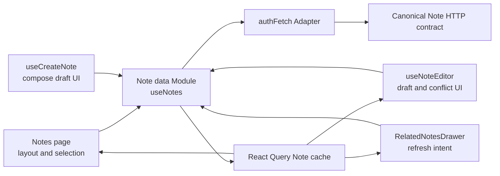

# Note Frontend State Convergence Phase 2 Design

**Status:** Approved for implementation
**Date:** 2026-08-19
**Depends on:** `2026-08-18-note-architecture-hardening-phase-1-design.md`

## 1. Executive decision

Proceed with this phase.

This is a necessary architecture correction, not a file-count or line-count refactor. Phase 1 established one canonical backend Note write contract, revision-based compare-and-set, canonical response snapshots, and revision-safe enrichment. The frontend still distributes the consumption of that contract across `useNoteEditor`, `useCreateNote`, `useNotes`, `ModernNoteCard`, and the Notes page.

That distribution has already caused real correctness defects: successful JSON-only and keyword-only writes once lost the canonical `recommendCache.sourceRevision` while travelling through positional callbacks. The defects were caught during Phase 1 acceptance and required two additional regression tests. The same failure mode remains possible for any future canonical field because the frontend still manually reconstructs partial Note objects.

The selected change deepens the existing frontend Note data Module. It will own Note requests, response decoding, React Query cache writes, optimistic creation, conflict classification, recommendation cache refresh, and bounded enrichment polling. UI Modules will own only UI state and user intent.

Expected outcome:

- every successful Note write applies one complete canonical server snapshot;
- a 409 keeps the local edit while updating shared state to the current server snapshot;
- no caller receives raw `setNotes` or field-specific cache patch callbacks;
- the Notes page contains no Note HTTP orchestration or polling timers;
- normal create/update request counts remain one write request;
- existing visual and interaction behaviour is preserved.

## 2. Necessity, benefit, and cost review

### 2.1 Evidence that the optimization is necessary

Current production code has the following architecture friction:

1. `useNoteEditor.ts` performs three PATCH variants and then decomposes the canonical Note into positional callback arguments. The content path passes id, content, updated time, JSON, plain text, revision, and recommendation cache separately.
2. `ModernNoteCard.tsx` repeats the same three field-specific callback Interfaces only to pass them through.
3. `useNotes.ts` exposes raw `setNotes` plus `updateTitle`, `updateContent`, `updateKeywords`, and `updateRecommendCache`. Each callback knows a different partial merge rule.
4. `useCreateNote.ts` directly owns the POST, creates a temporary Note, updates React Query through a setter supplied by another Module, parses the response, and starts polling through another callback.
5. `page.tsx` owns enrichment timers, direct recommendation HTTP, response-to-cache conversion, and the wiring among all of the above.
6. The Phase 1 `useNoteEditorCachePropagation` regressions demonstrate that this is not theoretical coupling: a canonical field was lost on real success paths.

The deletion test confirms the opportunity. Deleting the current field-specific callbacks does not remove complexity; it pushes response parsing and cache merge rules back into every editor and page caller. A deep Note data Module earns its place because deleting it would redistribute canonical snapshot application, optimistic lifecycle, conflict handling, polling, and freshness rules across several callers.

### 2.2 Benefits

| Benefit | Expected value | Why |
|---|---:|---|
| Correctness | High | Full snapshot replacement prevents future canonical fields from being silently dropped or stale fields from surviving a server `null`. |
| Locality | High | HTTP contract knowledge and React Query mutation rules live in one Implementation. |
| Leverage | High | Create, title, body, keywords, conflict recovery, polling, and recommendation refresh use the same cache rules. |
| Test quality | High | Tests cross the same Note data Interface as production callers instead of asserting private setter choreography. |
| Page simplicity | Medium | The page returns to layout, selection, compose/editor coordination, and rendering. |
| Runtime performance | Low to medium | Pending Note polling is coalesced into one list refetch loop; redundant per-Note timers disappear. |

### 2.3 Costs and accepted risks

| Cost or risk | Level | Control |
|---|---:|---|
| Refactor across several frontend files | Medium | Migrate in vertical slices with characterization tests before deleting old callbacks. |
| Draft/conflict regression | Medium | Keep draft state in `useNoteEditor`; add cross-Module 409 tests before changing wiring. |
| React Query timing tests | Medium | Use a fresh QueryClient per test and fake timers only for polling tests. |
| Optimistic creation regression | Low to medium | Roll back only the owned temporary id, never restore a captured whole-list snapshot. |
| New abstraction becoming another pass-through | Low | Deepen `useNotes`; do not add a generic repository, store framework, or exported HTTP client Interface. |

The benefit exceeds the cost because the backend contract is now stable, the affected frontend paths already have regression coverage, and the dominant risk is concentrated in one bounded screen rather than the whole application.

## 3. Goals

1. Make the frontend Note data Module the only owner of normal Note HTTP requests and React Query Note cache mutations.
2. Apply the full canonical Note returned by every successful POST/PATCH.
3. Represent a revision conflict as a typed frontend error carrying the current canonical server snapshot.
4. Preserve local body, title, and keyword edits after a conflict.
5. Keep one optimistic temporary Note during creation and replace or remove only that Note.
6. Coalesce pending-enrichment refresh into one visibility-aware, bounded list polling loop.
7. Make explicit recommendation refresh revision-safe in the local cache.
8. Reduce the Interfaces of `useNoteEditor`, `useCreateNote`, `ModernNoteCard`, and the Notes page.
9. Preserve Phase 1's single-write request contract.

## 4. Non-goals

This phase must not:

- change backend routes, schemas, persistence, revision rules, enrichment rules, or response contracts;
- remove the backend legacy Note compatibility Adapter;
- introduce Redux, Zustand, Context-based global state, a generic repository, or a generic data-access layer;
- create a `NoteRepository` Interface or a configurable transport Interface for the single `authFetch` implementation;
- create a universal HTTP client, command bus, mutation factory, or cross-domain DTO package;
- refactor Auth, Chat, Profile, recommendation algorithms, rich-text controls, or visual design;
- split `ModernNoteCard` merely because it is large;
- redesign conflict resolution or add automatic merge;
- add durable jobs, WebSockets, server push, or background sync;
- edit `docs/architecture-visual/`, which remains unrelated user-owned dirty work;
- commit, push, reset, or revert the existing dirty worktree.

## 5. Architecture vocabulary and domain scope

This design uses the following architecture terms deliberately:

- **Module:** the frontend Note data hook and its private Implementation.
- **Interface:** the query state and Note intent functions exposed to callers, including their ordering and error rules.
- **Seam:** the point where Notes UI calls the Note data Module.
- **Adapter:** the concrete `authFetch`/React Query integration hidden inside the Module.
- **Depth:** all canonical response, cache, optimistic, conflict, polling, and freshness behaviour behind a small Interface.
- **Leverage:** every Note caller receives the same correct behaviour.
- **Locality:** a contract or cache rule changes in one Implementation.

No new domain term is introduced. The existing domain concepts are Note, Note revision, Note enrichment, local draft, and recommendation cache.

## 6. Alternatives considered

### 6.1 Keep the current callback graph

This has the lowest immediate edit cost, but it preserves the exact path that lost canonical fields in Phase 1. Adding a callback parameter whenever the server adds a field makes the Interface grow with the Note DTO and keeps tests coupled to implementation choreography. Rejected.

### 6.2 Add a generic frontend repository or global store

A repository or global state framework could centralize calls, but the application currently has one Note HTTP Adapter and React Query already owns server state. A new configurable Seam would be hypothetical, would add migration cost outside Notes, and would not itself guarantee full canonical snapshot application. Rejected.

### 6.3 Deepen the existing Note data Module

Keep React Query and `authFetch`, but hide them behind `useNotes`. Expose domain intents rather than raw setters. This produces the most Locality and Leverage with the smallest new Interface. Selected.

## 7. Target architecture



Ownership rules:

- `useNotes` owns list fetch, create, update, delete, full canonical snapshot application, optimistic temporary Notes, conflict decoding, recommendation refresh writes, and enrichment polling.
- `useCreateNote` owns compose input, submit/loading state, clearing the compose draft after success, and user-facing create errors. The page may preserve the current close-on-submit interaction because active-editor layout remains page state.
- `useNoteEditor` owns editing state, draft persistence, edit-baseline revisions, save indicators, and conflict presentation.
- `ModernNoteCard` renders a Note and forwards user intent; it does not know cache merge rules.
- `page.tsx` owns layout, active editor selection, deletion confirmation, note selection, highlighting, and draft collection. It does not call Note or recommendation HTTP directly.
- `RelatedNotesDrawer` decides when a missing/stale recommendation cache should request refresh, but it supplies only the Note id. It does not supply revision or timestamp freshness data.

## 8. Note data Module Interface

The following is the required logical Interface. Exact local type placement can follow existing TypeScript conventions, but it must not be wrapped by a second synonymous pass-through Module.

```ts
type RichTextDocument = Record<string, unknown>;

type NoteBodyInput =
  | { kind: 'rich-text'; document: RichTextDocument; fallbackMarkdown?: string }
  | { kind: 'plain-text'; text: string };

type CreateNoteCommand = {
  body: NoteBodyInput;
  optimistic: {
    contentText: string;
    contentJson?: RichTextDocument | null;
  };
};

type UpdateNoteCommand = {
  noteId: string;
  expectedRevision: number;
  changes: {
    body?: NoteBodyInput;
    title?: string;
    keywords?: string[];
  };
};

class NoteWriteConflict extends Error {
  readonly code = 'NOTE_WRITE_CONFLICT';
  readonly current: Note;
}

type NoteDataModule = {
  notes: Note[];
  isLoading: boolean;
  createNote(command: CreateNoteCommand): Promise<Note>;
  updateNote(command: UpdateNoteCommand): Promise<Note>;
  deleteNote(noteId: string): Promise<void>;
  refreshRecommendCache(noteId: string): Promise<void>;
  refetchNotes(): Promise<unknown>;
};
```

`refetchNotes` may remain for explicit screen-level recovery, but it must not be used by the page to implement polling. Do not expose:

- `setNotes`;
- `updateTitle`;
- `updateContent`;
- `updateKeywords`;
- `updateRecommendCache`;
- `startEnrichmentPolling`;
- a React Query client;
- request/response DTOs that callers must decode;
- an Adapter injection option that has no second production Adapter.

## 9. Canonical response and cache rules

### 9.1 Response decoding

For POST/PATCH success, accept only the Phase 1 canonical shape:

```ts
{
  success: true,
  data: {
    note: NoteDto,
    enrichment: {
      sourceRevision: number,
      status: 'pending' | 'ready' | 'degraded'
    }
  }
}
```

The frontend canonical Note is:

```ts
const canonical = {
  ...data.note,
  enrichment: data.enrichment,
};
```

Missing `data.note`, invalid `_id`, invalid positive `revision`, or missing/invalid enrichment on a write response is a contract error. Do not treat an invalid success body as a successful mutation.

GET already returns Notes whose `enrichment` is embedded. Keep one frontend `Note` shape for GET and writes.

### 9.2 Full snapshot replacement

On successful update, replace the matching cached Note with the canonical Note. Do not rebuild the result from request fields and do not retain arbitrary server-owned fields from the old snapshot.

Consequences:

- server `recommendCache: null` clears the local cache;
- server-updated `summary`, `concepts`, title, keywords, timestamps, and future canonical fields survive without new callback parameters;
- `revision` and `enrichment` always move together;
- no `undefined` positional argument can accidentally preserve stale state.

The only client-only state currently attached to a Note, `enriching`, must be removed. Rendering uses `note.enrichment?.status === 'pending'`. Temporary Notes may carry a synthetic enrichment view with revision `0` while the POST is pending.

### 9.3 Conflict response

For a 409 `NOTE_WRITE_CONFLICT`, decode:

```ts
{
  code: 'NOTE_WRITE_CONFLICT',
  current: {
    note: NoteDto,
    enrichment: EnrichmentView
  }
}
```

Then:

1. combine and validate the current canonical Note;
2. replace the shared cached Note with that server snapshot;
3. throw `NoteWriteConflict` carrying the snapshot;
4. let the UI Module preserve and present its local edit.

Updating shared cache on conflict is intentional: other views must not keep rendering the stale revision. The editor draft remains separate and must not be overwritten by the cache update.

Malformed 409 data becomes a normal write error and must not mutate the cache.

### 9.4 Other errors

Non-409 failures reject with a stable user-safe message derived from the response when available. The data Module must not pretend a failed write succeeded. UI Modules decide where to display the error.

## 10. Mutation behaviour

### 10.1 Optimistic create

`createNote` owns the complete temporary Note lifecycle:

1. generate a unique temporary id;
2. insert one temporary Note at the front of `['notes']`;
3. issue one canonical POST;
4. replace only that temporary id with the canonical Note on success;
5. remove only that temporary id on failure;
6. return the canonical Note or reject.

Never restore a captured copy of the entire list during rollback; doing so could erase concurrent updates or other optimistic creates.

The temporary Note may use a blank title/keywords to preserve the current skeleton behaviour, revision `0`, and synthetic pending enrichment. Its content comes from `command.optimistic`, not from an untrusted attempt to duplicate the backend rich-text normalizer.

`useCreateNote` clears its compose input only after `createNote` resolves. The page may keep closing the compose shell immediately on submit as it does today. On failure, the input remains retryable when compose is reopened even though the temporary list item is removed.

### 10.2 Update

`updateNote` issues exactly one PATCH using the supplied `expectedRevision`, decodes the result, applies the full canonical snapshot, and returns it.

`expectedRevision` remains part of the Interface because it is the revision on which a local edit was based. The data Module must not silently replace it with whatever revision happens to be in React Query at save time.

`useNoteEditor` captures a baseline revision when a title, body, or keyword edit begins. A background refetch may update the Note prop, but it must not silently advance the edit baseline. When a typed conflict is returned, the editor records `current.revision` as a separate retry revision while preserving and showing the local edit. Only a new, explicit user save/commit action may use that retry revision. This prevents both accidental overwrite after a background refetch and an infinite retry against the already-conflicted revision.

After success, the editor uses the returned canonical Note only to settle UI state and clear its draft. It does not patch React Query itself.

### 10.3 Delete

Delete remains one request. On success remove the Note id from the cache. On failure keep it and reject so existing error presentation remains possible.

### 10.4 Recommendation refresh

`refreshRecommendCache(noteId)` owns `/api/recommend/semantic-notes` and the local cache update.

Rules:

1. read the source Note and capture its current revision before the request;
2. send the existing explicit refresh request;
3. build the cache using that captured Note snapshot;
4. before applying, read the current cached Note again;
5. apply only if its revision still equals the captured revision;
6. otherwise discard the late local result because the backend/current Note owns freshness.

This route does not return a complete canonical Note, so a guarded `recommendCache`-only update is the one documented exception to full Note replacement. The exception remains private to the Note data Implementation.

`RelatedNotesDrawer` receives `(noteId: string) => Promise<void>`. It no longer passes `updatedAt` or `revision` because freshness belongs to the data Module.

## 11. Enrichment polling

Replace the page's map of per-Note timers with one coalesced polling Implementation inside the Note data Module.

Required semantics:

- A canonical create/update with `enrichment.status === 'pending'`, or a GET containing pending Notes, registers the pair `(noteId, sourceRevision)` for observation.
- Use one list refetch to refresh all pending Notes; do not create one GET request per Note.
- Start no earlier than five seconds after pending is observed.
- Allow at most five polling refetch attempts for a given `(noteId, sourceRevision)` and stop no later than sixty seconds after observation.
- Remove an observation when the Note becomes ready/degraded, is deleted, or advances to another revision.
- Do not poll while the document is hidden or the window is unfocused. A normal focus/visibility refetch may resume remaining attempts.
- Clean up timers and listeners on unmount.
- Polling never calls enrichment maintenance routes and never changes Note revision.

The old DOM query that checks whether an individual card is in the viewport is intentionally removed. A single bounded list refetch serves all pending Notes, so coupling the data Module to Note DOM nodes would create a shallow UI Seam for little additional value.

## 12. UI Module changes

### 12.1 `useCreateNote`

Keep:

- `newContentText` and `newContentJson`;
- compose loading state;
- submit validation;
- clearing on success and retaining on failure.

Remove:

- `authFetch`;
- UUID generation;
- temporary Note construction;
- direct React Query setter use;
- canonical response parsing;
- `onEnrichmentPending`.

Its dependency becomes one `createNote` intent function.

### 12.2 `useNoteEditor`

Keep:

- reducer and UI state;
- rich-text draft and draft persistence;
- edit-entry/exit behaviour;
- save feedback timers;
- conflict text and retryable keyword UI;
- content format helpers unless separately justified by existing shared UI code.

Remove:

- `authFetch`;
- write response decoding;
- `onUpdateTitle`, `onUpdateContent`, and `onUpdateKeywords`;
- field-specific React Query merge knowledge;
- recommendation cache propagation parameters.

Add one `updateNote` intent dependency and use `NoteWriteConflict` for conflict-specific UI. Body conflict still exposes the current server text. Title and keyword conflicts keep their local input editable.

After a conflict, the next explicit save uses the conflict snapshot's revision. No automatic resubmit is allowed.

### 12.3 `ModernNoteCard`

Replace the three field-specific update props with one Note update intent. Do not otherwise redesign or split the card in this phase.

### 12.4 Notes page

Remove:

- raw `setNotes` wiring;
- field-specific update wiring;
- enrichment timer map and start/stop functions;
- direct recommendation HTTP and cache construction;
- `authFetch` and recommendation response helper imports used only by those paths.

Keep page-specific layout, active editor, draft collection, selection, deletion confirmation, highlighting, editor warm-up, and scroll behaviour.

## 13. Migration slices

### Slice 0: protect the dirty worktree and re-establish the baseline

- Record `git status` and inspect diffs for every overlapping Note frontend file.
- Preserve all existing Auth, Chat, Profile, rich-text UI, dependency, architecture-visual, and other user changes.
- Run the current frontend tests/typecheck before editing.
- Do not commit or push.

### Slice 1: characterize the Note data Interface

- Add focused `useNotes` tests for canonical response decoding and cache application.
- Add a failing test proving server `recommendCache: null` clears local state.
- Add a failing test proving future/extra canonical fields are preserved through full replacement.
- Add a failing typed 409 test proving current server state enters the cache.
- Add optimistic create replacement and isolated rollback tests.

### Slice 2: deepen `useNotes`

- Implement canonical POST/PATCH decoding and `NoteWriteConflict`.
- Implement `createNote` and `updateNote` with full snapshot replacement.
- Keep delete behind the same Interface.
- Remove the public raw setter and field-specific cache callbacks only after migrated tests/callers exist.
- Eliminate `Note.enriching` in favour of canonical enrichment.

### Slice 3: migrate compose and editor callers

- Make `useCreateNote` depend on `createNote` only.
- Make `useNoteEditor` depend on `updateNote` only.
- Capture edit-baseline revision rather than taking the newest cache revision implicitly at save time; advance to a conflict snapshot revision only for a later explicit retry.
- Update `ModernNoteCard` and page wiring.
- Convert the existing cache propagation test into a cross-Module test through the new Interface instead of positional callbacks.

### Slice 4: move recommendation refresh and polling

- Move explicit recommendation refresh into the Note data Implementation with a revision guard.
- Narrow the drawer callback to Note id only.
- Implement one bounded, coalesced enrichment polling loop.
- Add fake-timer tests for ready/degraded stop, revision advancement, hidden/unfocused pause, attempt limit, and cleanup.
- Delete page timers and direct recommendation HTTP.

### Slice 5: remove dead Interface and verify scope

- Use `rg` to prove no Notes caller uses raw `setNotes`, the three field update callbacks, `onEnrichmentPending`, or `Note.enriching`.
- Remove obsolete tests only after equivalent Interface-level coverage exists.
- Review every diff against this Spec and the pre-existing dirty worktree.

## 14. Test strategy

The Note data Interface is the primary test surface. Tests must use a fresh QueryClient and render the real hook where practical.

Required coverage:

1. GET loads canonical Notes with embedded enrichment.
2. Create performs one POST, inserts one temporary Note, and replaces it with canonical Note plus enrichment.
3. Create failure removes only its temporary id while preserving other concurrent cache changes and compose input.
4. Update performs one PATCH with the edit-baseline revision.
5. Successful update replaces the whole snapshot; canonical `null` clears stale local data.
6. JSON-only and keyword-only success preserve the returned `recommendCache.sourceRevision` without positional propagation.
7. 409 applies the current server snapshot to shared cache and throws `NoteWriteConflict`.
8. Body, title, and keyword UI keep local edits retryable after that conflict.
9. A background refetch does not advance an active edit's revision; a typed conflict enables exactly a later explicit retry against the returned current revision and never auto-resubmits.
10. A malformed success or malformed conflict response does not mutate cache.
11. A late recommendation refresh cannot overwrite a newer Note revision.
12. Recommendation refresh for the same revision updates only the expected cache field.
13. Pending enrichment uses one coalesced list refetch loop, stops on terminal state/revision change, pauses in background, and respects five-attempt/sixty-second bounds.
14. Delete success removes one Note; delete failure preserves it.
15. Page/Card wiring no longer requires field-specific mutation callbacks.
16. Existing rich-text draft, editor open/close, saved flash, drawer, and optimistic UX tests remain green.

Tests must not depend on implementation-only helper exports created solely for test convenience. Pure response validators may be tested directly only if they are naturally part of the private Note data Implementation and also exercised through the public hook Interface.

## 15. Acceptance criteria

Implementation is accepted only when all of the following are true:

- `useNotes` is the only normal frontend owner of Note create/update/delete HTTP and React Query Note cache writes.
- `page.tsx`, `useCreateNote.ts`, and `useNoteEditor.ts` do not import `authFetch` for Note writes.
- The page contains no enrichment polling timers and no direct semantic recommendation request.
- No public raw `setNotes` or field-specific update callback remains.
- Every successful POST/PATCH applies a validated full canonical Note plus enrichment.
- A canonical `recommendCache: null` clears local cache.
- A 409 updates shared canonical state, throws typed conflict data, and preserves local edit state.
- Optimistic create rollback is id-scoped.
- Recommendation refresh is locally revision-guarded.
- Polling is coalesced, visibility-aware, and bounded to five attempts/sixty seconds per Note revision.
- Create and update each issue exactly one normal Note write request.
- No backend or unrelated subsystem behaviour changes.
- No generic repository/store/client abstraction is introduced.
- All required tests, typechecks, lint, build, and whitespace checks pass.

## 16. Verification commands

Run from the repository root in a fresh shell:

```bash
npm run verify
npm --prefix frontend run lint
npm --prefix frontend run build
git diff --check
```

Also run focused frontend Note tests during development. The final report must state exact test counts and any warning output; warnings may not be hidden by weakening configuration.

## 17. Rollback and deployment

This phase is frontend-only and additive at the contract level. It requires no data migration and no deployment ordering beyond deploying after Phase 1 backend compatibility is present.

If a production regression appears, the frontend wiring can be reverted to the prior callbacks without rolling back data. Do not roll back the Phase 1 backend revision protocol or canonical HTTP contract.

## 18. Explicitly deferred follow-up

After this phase is accepted, return to the broader architecture review. The next candidate is frontend Chat Session Runtime convergence. Compatibility Adapter retirement remains gated on real client/telemetry evidence and is not authorized by this Spec.
