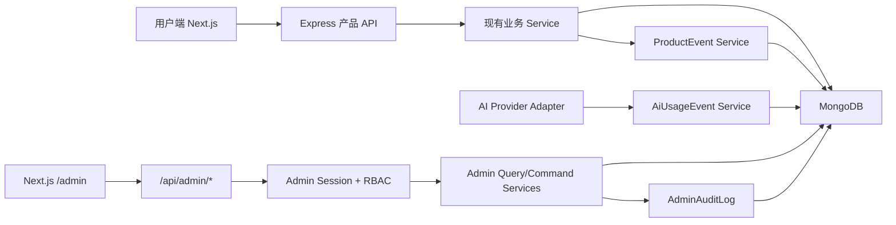

# NoteWithAI 国内运营后台 Phase 1 设计

日期：2026-08-31

状态：用户已确认，待 Terra 实施

实施模型：GPT-5.6 Terra，medium 推理强度

验收模型：提出本 Spec 的当前 Session

## 1. 决策摘要

在短期只有中国大陆用户、后台主要由创始人和极少数运营人员使用、尽量不增加现金支出的前提下，本阶段建设一套原生运营后台：后台页面位于现有 Next.js 应用的 `/admin`，管理接口位于现有 Express 应用的 `/api/admin/*`，数据继续保存在现有 MongoDB。

本阶段不接入 Google Analytics、Firebase Analytics、Appsmith Cloud、Appsmith Community、Umami、PostHog、Grafana、独立数据仓库或新的数据库。这样既不增加订阅费用和独立运行服务，也避免国内用户的产品数据为了内部运营而流向第三方。

“不引入第三方后台”不等于把管理权限做进普通用户界面。后台使用独立管理员身份、独立 JWT 密钥、HttpOnly Cookie、强制 TOTP 二次验证、服务端权限校验和不可通过产品 API 删除的操作审计。所有管理写操作必须经过 Admin API，后台 UI 不直接连接 MongoDB。

本阶段交付五个可用模块：数据概览、用户管理、AI 使用与异常、用户反馈、系统与审计。支付、订阅、退款、优惠券、数据导出/注销执行器和海外分析留待对应业务出现时单独立项。

## 2. 目标与可衡量结果

实施完成后必须达到：

1. `/admin/login` 使用独立管理员账号、密码和 6 位 TOTP 登录；普通用户 JWT 无法访问任何 `/api/admin/*` 业务接口。
2. 管理会话只存在于 `HttpOnly` Cookie，不写入 `localStorage`；生产环境 Cookie 同时设置 `Secure`、`SameSite=Strict` 和 `/api/admin` Path。
3. 后台首页可以查看总用户、今日新增、DAU/WAU/MAU、笔记数、聊天会话数、AI 调用次数、AI 成功率、已上报 Token 与估算成本、失败富化任务数及最近 7/30 天趋势。
4. 活跃用户和核心行为使用第一方 `ProductEvent` 记录；事件名和属性为服务端白名单，任何笔记正文、聊天内容、Prompt、AI 回复、邮箱和手机号都不得进入事件属性。
5. 后台可以分页搜索用户，查看账号、活跃、笔记、聊天和 AI 用量元数据；不能读取笔记正文、聊天正文、Prompt 或 AI 回复。
6. 具有权限的管理员可以禁用或恢复用户；每次操作必须填写原因并生成审计记录。禁用后，新登录和已有普通用户 Token 请求都被拒绝。
7. 所有 DeepSeek 非流式与流式调用以及 embedding 调用在 provider 边界记录 `AiUsageEvent`；可获得 provider usage 时保存真实 Token，不可获得时保存 `null`，不得伪造估算 Token。
8. 后台可以查看失败的 Note enrichment artifact，并对仍处于同一 `revision` 的单个 artifact 发起一次安全重试；旧 revision 或并非失败状态的任务必须拒绝。
9. 用户可以通过产品内认证接口提交反馈；后台可以分页、筛选、修改反馈状态和内部备注。内部备注绝不返回普通用户接口。
10. 后台可以查看系统健康摘要与管理员审计记录；审计记录没有删除或修改 API。
11. 全部新增行为有后端 `node:test` 或前端 Vitest 覆盖，根目录 `npm run verify` 通过；后台页面的生产构建通过。

## 3. 非目标

Terra 不得在本 Spec 下实施：

- 不接入 GA4、Firebase、Google Tag Manager 或任何海外归因 SDK。
- 不部署 Appsmith、Umami、PostHog、Grafana、ClickHouse、PostgreSQL 或新的 Redis 实例。
- 不建立微服务、消息队列、事件总线、数据湖、ETL 平台或通用工作流引擎。
- 不实现订单、套餐、订阅、支付、退款、优惠券、发票或多币种。
- 不实现完整客服工单系统、消息通知、客服聊天或 SLA。
- 不实现用户数据导出和物理删除执行器；本期只保留未来入口位置，不提供假按钮。
- 不允许管理员从后台查看、搜索或导出笔记正文、聊天正文、Prompt、AI 回复或 embedding 向量。
- 不做可配置的通用 RBAC 编辑器；角色和权限矩阵在代码中固定。
- 不以“统计方便”为由把现有产品数据批量复制到新的统计库。
- 不改造 Note、Chat、推荐算法的业务行为，除非是增加无内容的事件/用量记录或修复禁用账号仍可凭旧 Token 使用的问题。

## 4. 方案比较与最终选择

| 方案 | 优点 | 成本与风险 | 决定 |
|---|---|---|---|
| 现有应用内原生 `/admin` | 零新增订阅和服务；复用 Next.js/Express/MongoDB；权限与审计完全受控 | 需要开发 UI；不能拖拽生成页面 | 采用 |
| Appsmith Community 自托管 + Admin API | CRUD 页面搭建快；软件许可免费 | 新增运行服务、升级、资源和安全面；当前页面数量不足以抵消成本 | 暂不采用，后台超过约 10 个高频 CRUD 页面时再评估 |
| Appsmith Cloud 免费版 | 无需自己部署 | 数据和管理入口依赖外部云；免费协作限制；国内网络与数据边界不符合当前目标 | 不采用 |
| 自托管分析平台 + Appsmith | 现成图表、漏斗和后台 UI | 至少新增一个数据库及多个容器，过早引入运维复杂度 | 不采用 |

本阶段坚持模块化单体。业务事件是产品内部的事实记录，不建设通用埋点平台；管理接口是明确的运营用例，不建设任意集合 CRUD。

## 5. 目标架构与边界



边界规则：

- `frontend/src/app/admin` 只负责展示、筛选、确认和调用 Admin API，不包含权限真相。
- `backend/routes/admin` 只负责 cookie/参数解析、Zod 校验和 HTTP 映射。
- `backend/services/admin` 负责管理员认证、权限、统计查询、用户状态命令、反馈流转、任务重试和审计。
- 普通产品 API 不能导入 Admin service；Admin API 可以读取现有模型的最小投影。
- 管理员写操作必须通过显式命令方法，不提供 `PATCH /collections/:name/:id` 一类通用数据库修改接口。
- 事件和 AI 用量记录为 best-effort：记录失败不得让已经成功的用户核心写入失败，但必须写结构化错误日志。
- 管理写操作不是 best-effort：必须先建立 `pending` 审计记录，再执行幂等命令，最后将该审计记录标为 `succeeded` 或 `failed`。中途故障保留 `pending`，供 owner 识别不确定状态。

## 6. 管理员身份、会话与权限

### 6.1 AdminAccount

管理员与普通 `User` 分离，模型至少包含：

```ts
type AdminRole = 'owner' | 'operator' | 'support' | 'viewer';

type AdminAccount = {
  email: string;
  displayName: string;
  passwordHash: string;
  totpSecretEncrypted: string;
  role: AdminRole;
  isActive: boolean;
  tokenVersion: number;
  lastLoginAt?: Date;
  createdAt: Date;
  updatedAt: Date;
};
```

- 邮箱规范化为小写并唯一。
- 密码至少 12 位，必须同时含字母和数字，使用现有 `bcryptjs` 哈希。
- TOTP 使用成熟库实现 RFC 6238，不自行实现密码算法。
- TOTP secret 使用 `ADMIN_ENCRYPTION_KEY` 做认证加密后持久化，不明文保存。
- 首个 owner 通过仅限命令行的 `admin:create` 脚本创建；脚本从受控环境变量读取一次性初始化输入，输出 TOTP provisioning URI，不提供公开 bootstrap HTTP 接口。

### 6.2 Session

管理员 JWT payload：

```ts
type AdminJwtPayload = {
  typ: 'admin';
  adminId: string;
  role: AdminRole;
  tokenVersion: number;
};
```

- 使用独立的 `ADMIN_JWT_SECRET`，默认有效期 8 小时。
- Cookie 名为 `nwai_admin_session`，`HttpOnly`、`SameSite=Strict`、Path=`/api/admin`；生产环境 `Secure=true`。
- 每次 Admin API 请求都验证签名、`typ`、管理员存在、`isActive` 和 `tokenVersion`。
- 登录限速按规范化邮箱与 IP 组合执行；错误统一返回“邮箱、密码或验证码错误”，不得暴露账号是否存在。
- mutation 请求同时校验 `Origin` 必须在 `ALLOWED_ORIGINS`，并拒绝缺失或不匹配来源。
- 登出清除 Cookie。owner 禁用管理员或增加 `tokenVersion` 后，旧会话立即失效。
- Admin API 响应统一添加 `Cache-Control: no-store`。

### 6.3 固定权限矩阵

| 能力 | owner | operator | support | viewer |
|---|---:|---:|---:|---:|
| 查看概览和系统摘要 | ✓ | ✓ | ✓ | ✓ |
| 查看用户元数据 | ✓ | ✓ | ✓ | ✓ |
| 禁用/恢复普通用户 | ✓ | ✓ |  |  |
| 查看 AI 用量和失败任务 | ✓ | ✓ | ✓ | ✓ |
| 重试失败 artifact | ✓ | ✓ |  |  |
| 查看和处理反馈 | ✓ | ✓ | ✓ | 仅查看 |
| 查看审计日志 | ✓ | ✓ |  |  |
| 管理管理员账号 | ✓ |  |  |  |

Phase 1 只实现首个 owner 的 CLI 创建和上述运行期校验；管理员列表/新增/禁用 UI 可以延期，但 service 权限不得硬编码为“所有管理员都是 owner”。

## 7. 第一方事件与指标定义

### 7.1 ProductEvent

```ts
type ProductEventName =
  | 'user_registered'
  | 'user_active_day'
  | 'note_created'
  | 'chat_turn_committed'
  | 'association_opened'
  | 'feedback_submitted';

type ProductEvent = {
  name: ProductEventName;
  userId: ObjectId;
  occurredAt: Date;
  dayKey: string; // Asia/Shanghai YYYY-MM-DD
  source: 'server' | 'web';
  properties: Record<string, string | number | boolean | null>;
};
```

- `name` 使用编译期 union 和运行期 Zod enum 双重白名单。
- `properties` 每个事件使用自己的 Zod schema，拒绝额外字段；单个字符串最多 100 字符。
- 普通用户只可主动上报 `association_opened`；其余事件由服务端权威路径产生。
- `user_active_day` 对 `{ name, userId, dayKey }` 建唯一索引，并使用 upsert，确保一个用户每天最多一条。
- 事件保留 400 天；通过 MongoDB TTL index 清理更老数据。
- 不记录 IP、精确地理位置、User-Agent 原文、内容、邮箱、手机号或外部广告标识。

### 7.2 指标口径

所有自然日以 `Asia/Shanghai` 计算：

- 总用户：`User.countDocuments()`。
- 今日新增：`User.createdAt` 落在今日。
- DAU/WAU/MAU：过去 1/7/30 个自然日内有 `user_active_day` 的去重用户。
- 激活用户：注册后 7 天内产生第一条 `note_created` 且该 Note 至少一个 enrichment artifact 成为 `ready`；Phase 1 首页展示数量，不展示内容。
- 笔记数：`Note.countDocuments()`；趋势按 `createdAt` 聚合。
- 聊天会话数：`Chat.countDocuments()`；聊天轮次趋势使用 `chat_turn_committed`。
- AI 成功率：选定时间范围内 `AiUsageEvent.status = succeeded` 数量 / 全部结束事件数量。
- Token：只累加非空的 provider usage；UI 同时展示“Token 覆盖率”，避免把部分数据误认为全量。
- 估算成本：`inputTokens * inputPrice + outputTokens * outputPrice`；单价来自服务端只读配置并带币种/生效时间。未配置价格或缺 Token 的记录不计入金额，并显示覆盖率。
- 失败富化任务：当前 Note `enrichment.*.status = failed` 的 artifact 数量，而不是历史失败次数。
- 留存：Phase 1 API 返回 D1/D7/D30 口径字段；当观察窗口不足时返回 `null`，UI 显示“数据积累中”，不能显示 0%。

Phase 1 直接依赖有索引的 MongoDB 聚合，不新增 `daily_metrics`。当 30 天概览查询 P95 超过 500ms 或事件规模超过 100 万条时，再单独设计每日聚合表。

## 8. AI 用量与失败任务

### 8.1 AiUsageEvent

```ts
type AiUsageEvent = {
  requestId: string;
  userId?: ObjectId;
  provider: 'deepseek' | 'openrouter' | 'dashscope';
  model: string;
  operation: 'chat' | 'chat_title' | 'note_meta' | 'note_concepts' | 'rerank' | 'embedding' | 'care_intro';
  status: 'succeeded' | 'failed' | 'aborted';
  startedAt: Date;
  finishedAt: Date;
  durationMs: number;
  inputTokens: number | null;
  outputTokens: number | null;
  totalTokens: number | null;
  estimatedCostMicros: number | null;
  currency: 'CNY';
  errorCode?: string;
};
```

- `requestId` 唯一，便于流式调用在结束时只写一条最终记录。
- 不存请求消息、响应文本、Note/Chat 正文、Prompt 或 provider 原始响应。
- provider 返回 usage 时保存真实值；未返回时字段为 `null`。
- 流式聊天请求必须请求 provider 的 usage 汇总；用户中断记录 `aborted`。
- error 只保留归一化 `errorCode`，不把可能含内容的原始错误 body 写入模型。
- provider adapter 接受显式 telemetry context；不使用全局可变 `currentUser`。

### 8.2 artifact 安全重试

后台列表只投影：Note ID、用户 ID、artifact、sourceRevision、attemptedAt、errorCode、当前 Note revision。不得投影 Note 内容、title、summary、keywords、embedding 或推荐结果。

重试命令输入 `{ noteId, artifact, expectedRevision, reason }`，并满足：

1. 管理员具有 `ai:retry` 权限。
2. Note 当前 `revision === expectedRevision`。
3. 对应 artifact 当前为 `failed` 且 `sourceRevision === expectedRevision`。
4. 原子地把 artifact 标为 `pending` 后，再调用现有 `runProductionNoteEnrichmentTask`。
5. 并发请求只有一个能完成 `failed -> pending` 条件更新。
6. 返回最终 `saved | failed | stale`；所有尝试写审计。

本阶段不实现批量重试、自动重试策略或持久化队列。

## 9. 用户管理与隐私边界

用户列表和详情仅允许以下投影：

```ts
type AdminUserView = {
  id: string;
  username: string;
  maskedEmail: string;
  isActive: boolean;
  isVerified: boolean;
  createdAt: string;
  lastActiveAt: string | null;
  noteCount: number;
  chatCount: number;
  aiCalls30d: number;
  aiKnownTokens30d: number;
};
```

- 列表默认遮盖邮箱；仅 owner/operator/support 在用户详情中可以请求完整邮箱，viewer 始终只能看遮盖值。
- 查询支持 `page`、`limit`、`status`、`createdFrom`、`createdTo` 和精确 email/ID 或 username 前缀；禁止对 Note/Chat 内容搜索。
- `limit` 最大 100，默认 20；排序字段固定为 `createdAt` 或 `lastActiveAt`。
- 禁用/恢复请求必须包含 5–200 字原因。
- 禁用是幂等状态更新，不删除用户数据；恢复同理。
- 普通 `authenticateUser` 必须补齐 `isActive` 校验，使已有普通 JWT 也在禁用后失效。

## 10. 用户反馈

新增 `UserFeedback`：

```ts
type FeedbackCategory = 'bug' | 'experience' | 'feature' | 'billing' | 'other';
type FeedbackStatus = 'open' | 'in_progress' | 'resolved';

type UserFeedback = {
  userId: ObjectId;
  category: FeedbackCategory;
  content: string;
  contact?: string;
  appVersion?: string;
  status: FeedbackStatus;
  internalNote: string;
  assignedAdminId?: ObjectId;
  resolvedAt?: Date;
  createdAt: Date;
  updatedAt: Date;
};
```

- 产品接口 `POST /api/feedback` 要求普通用户认证；内容 5–2000 字，联系方式 0–200 字，单用户每小时最多 5 条。
- 普通用户接口只返回提交成功及 feedback ID，不提供内部备注。
- 后台可以按状态、类别、日期和用户 ID 筛选。
- 修改状态或内部备注必须审计；`internalNote` 最大 2000 字。
- 本阶段不发送邮件、不自动分配、不创建外部工单。

## 11. Admin API 契约

成功响应沿用 `{ success: true, data, message }`；失败沿用现有 AppError envelope。列表响应包含 `{ items, pagination }`。

### 11.1 认证

- `POST /api/admin/auth/login`：`{ email, password, otp }`；成功设置 Cookie并返回管理员最小身份。
- `POST /api/admin/auth/logout`：清除 Cookie。
- `GET /api/admin/auth/me`：返回 `{ id, displayName, email, role }`。

### 11.2 概览与系统

- `GET /api/admin/overview?range=7d|30d`。
- `GET /api/admin/system/health`：返回 Mongo 连接状态、进程 uptime、应用版本、失败 artifact 数量和 AI 最近 24 小时成功率；不返回环境变量、数据库 URI、API key、内存 dump 或内部网络地址。

### 11.3 用户

- `GET /api/admin/users`：分页筛选。
- `GET /api/admin/users/:id`：隐私受控详情。
- `POST /api/admin/users/:id/status`：`{ isActive, reason }`；幂等更新并审计。

### 11.4 AI

- `GET /api/admin/ai/usage?range=7d|30d`。
- `GET /api/admin/ai/failures`：分页返回失败 artifact 投影。
- `POST /api/admin/ai/failures/:noteId/retry`：`{ artifact, expectedRevision, reason }`。

### 11.5 反馈与审计

- `GET /api/admin/feedback`。
- `PATCH /api/admin/feedback/:id`：`{ status?, internalNote?, assignedToSelf? }`，至少一个字段存在。
- `GET /api/admin/audit`：owner/operator 可见，支持 actor/action/status/日期筛选；无写接口。

所有查询日期限制在最多 90 天，防止无界聚合。

## 12. 后台 UI

路由结构：

```text
/admin/login
/admin
/admin/users
/admin/users/[id]
/admin/ai
/admin/feedback
/admin/system
/admin/audit
```

UI 要求：

- 桌面优先但在窄屏可用；独立 AdminShell，不复用普通用户 TopNavigation。
- 左侧导航固定为概览、用户、AI、反馈、系统、审计；按角色隐藏无权限项，但服务端仍是权限真相。
- 概览包含指标卡、7/30 天切换和趋势图；优先使用轻量 SVG/CSS，不为首版引入大型图表库。
- 所有列表提供 loading、empty、error 和分页状态。
- 用户状态变更和 AI 重试使用明确确认对话框，要求输入原因；不使用浏览器原生 `confirm()`。
- 破坏性或敏感操作不能乐观更新；必须以后端 canonical 响应刷新。
- API 返回 401 时跳转 `/admin/login`；403 显示无权限，不清除普通用户登录状态。
- 管理后台样式与产品视觉可以一致，但必须通过“运营后台”标识避免管理员误以为正在操作个人账号。
- 不展示没有实现的支付、导出、删除、群发或批量操作按钮。

## 13. 数据模型与索引

新增模型：

- `AdminAccount`：`email` unique；`isActive + role` 辅助索引。
- `AdminAuditLog`：`requestId` unique；`createdAt`、`actorId + createdAt`、`action + createdAt`。
- `ProductEvent`：`name + occurredAt`、`userId + occurredAt`、`name + userId + dayKey` partial unique；`occurredAt` TTL 400 天。
- `AiUsageEvent`：`requestId` unique；`startedAt`、`userId + startedAt`、`provider + operation + startedAt`、`status + startedAt`。
- `UserFeedback`：`status + createdAt`、`userId + createdAt`。

修改 `User`：增加 `lastActiveAt?: Date`，并为 `createdAt`、`lastActiveAt` 建索引。

MongoDB 中不建立包含私密正文的后台全文索引。本阶段不复制 Note/Chat 内容。

## 14. 错误、安全与日志

- 管理接口参数全部经 Zod 校验；ObjectId 在查询前验证。
- 登录失败、权限拒绝和管理 mutation 使用稳定错误码；不把数据库和 provider 原始错误返回 UI。
- Admin 日志不得记录密码、OTP、Cookie、TOTP secret、完整 email 查询、反馈内容、笔记/聊天内容或 provider body。
- 管理员请求生成 `requestId`，响应头返回 `X-Request-Id`，审计和结构化日志共享该 ID。
- 对用户状态变更、反馈更新、artifact 重试使用 pending/succeeded/failed 审计状态。
- 对概览、列表和健康接口设置 `Cache-Control: no-store`。
- 现有 MongoDB 与 Redis 不得因为后台功能新增公开端口；部署仍通过应用层访问。
- `ADMIN_JWT_SECRET` 不得与普通 `JWT_SECRET` 相同；启动时在 production 校验二者不同。
- `ADMIN_ENCRYPTION_KEY` 必须为 32 字节密钥的受支持编码，配置解析失败时拒绝启动管理员功能。

## 15. 测试与验收

### 15.1 后端

至少覆盖：

- 普通 JWT、缺 Cookie、错误 `typ`、失效 `tokenVersion`、禁用管理员均被拒绝。
- 登录反枚举、密码/OTP 校验、限速、Cookie 属性、登出。
- 权限矩阵逐能力的允许/拒绝。
- mutation Origin 校验。
- 事件白名单、属性拒绝、`user_active_day` 去重、TTL/索引定义。
- 普通用户禁用后已有 Token 请求被拒绝。
- 用户列表不包含密码、正文和私密字段，viewer 永远只见遮盖邮箱。
- AI usage 成功、失败、中断、真实 usage 和无 usage 情况均只写无内容记录。
- artifact 重试 revision/status CAS 和并发拒绝。
- 反馈限速、后台流转和内部备注隔离。
- 审计 pending/succeeded/failed；不存在审计删除/修改路由。
- 概览指标口径、空数据、观察窗口不足和 Token 覆盖率。

### 15.2 前端

至少覆盖：

- 未登录跳转、有效会话进入后台、401 与 403 的不同处理。
- 角色导航和敏感按钮可见性。
- 概览 loading/empty/error/成功状态与 7/30 天切换。
- 用户搜索分页、详情隐私投影、状态确认与失败不乐观更新。
- AI 失败列表和输入原因后的重试。
- 反馈筛选、状态更新和错误恢复。
- 审计列表无任何写入口。

### 15.3 命令

```bash
npm --prefix backend run typecheck
npm --prefix backend test
npm --prefix frontend run typecheck
npm --prefix frontend test
npm --prefix frontend run build
npm run verify
```

验收必须记录所有命令的退出码和测试数量。若完整构建受环境而非代码阻塞，必须提供可复现日志，不能用“看起来没问题”代替。

## 16. 上线与回滚

上线顺序：

1. 配置独立 `ADMIN_JWT_SECRET`、`ADMIN_ENCRYPTION_KEY`、AI 单价和允许来源。
2. 先部署新增模型、索引和后端；普通产品行为保持兼容。
3. 使用 CLI 创建首个 owner，并在本地/受控环境完成 TOTP 绑定。
4. 部署 `/admin` 前端并验证 Cookie、Origin、角色和 no-store。
5. 观察事件写入失败率、Admin 5xx、概览 P95 和 AI usage 覆盖率。

回滚时可撤回前端和 Admin 路由；新增事件与审计集合保留，不做破坏性删除。普通 User/Note/Chat 的兼容字段不得阻止旧版本运行。事件记录失败始终不阻塞核心产品路径。

## 17. 延后触发条件

- 后台高频 CRUD 页面达到约 10 个或运营需求变化显著加快：重新评估 Appsmith Community，但仍只调用 Admin API。
- 30 天概览 P95 超过 500ms 或 ProductEvent 超过 100 万条：设计 `DailyMetric` 聚合，不直接上数据仓库。
- 开始收费：单独设计订单、权益、支付、退款和对账。
- 开始海外获客：在现有事件语义上增加 GA4/海外归因出口，并单独处理同意、数据路由和多语言。
- 管理员团队扩大：增加管理员生命周期 UI、更细权限、设备/session 管理和更强审计导出。

